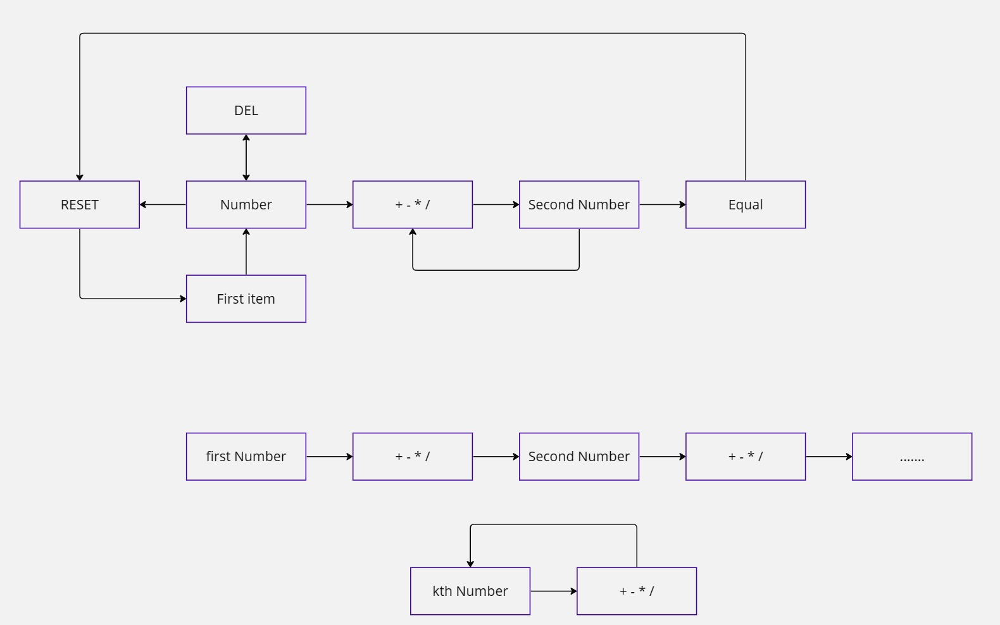
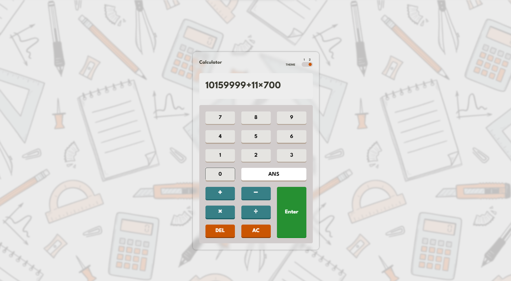
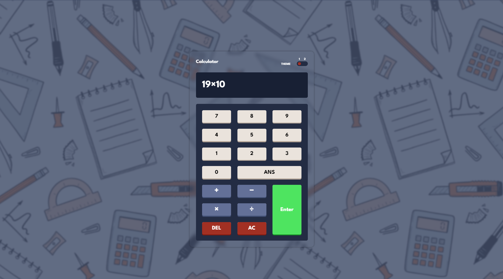

# Calculator app

Welcome to my Calculator-Website project! This interactive web calculator not only provides a sleek and user-friendly interface for performing basic arithmetic operations but also supports keyboard navigation for an enhanced user experience.

## [Live Demo](https://)
## Challenge from Frontend Mentor

This project is a solution to the [Frontend Mentor challenge](https://www.frontendmentor.io/challenges/calculator-app-9lteq5N29) for the [Calculator app](https://main--mansy-calculator.netlify.app/).

## Screanshots

### Overview

### Planning

### light Mode 

### Dark Mode 

## Key Features

- **Responsive Design:** Enjoy consistent performance across a variety of devices.
- **Keyboard Navigation:** Enhance your efficiency with seamless navigation using the keyboard.
- **Light/Dark Theme Support:** Toggle between light and dark themes to suit your preferences.
- **Error Handling:** Robust error-checking mechanisms ensure accurate and reliable calculations.
- **Intuitive UI (User Interface):** A thoughtfully crafted design ensures an easy and intuitive navigation experience.
- **Efficient Arithmetic Operations:** Perform basic calculations with precision and speed.

## Technologies Used

- HTML
- CSS
- SASS
- JavaScript
- ESLint

## How to Use

Navigate through the calculator effortlessly:

- **Number Input:** Use the keyboard or on-screen buttons to input numerical values.
- **Arithmetic Operations:** Trigger addition, subtraction, multiplication, and division with ease.
- **ANS Key:** Instantly recall and reuse the last calculated result.
- **Enter Key:** Execute calculations swiftly using the Enter key.
- **Delete (DEL) Key:** Make quick corrections by removing the last digit.
- **Clear (AC) Key:** Reset the calculator to zero for a fresh start.

## Author

- Website - [abdelrahmanayman48](https://)
- Github - [AbdelrahmanAyman48](https://github.com/AbdelrahmanAyman48/calculator-web-app)
- Linkedin - [Abdelrahman-Ayman](https://www.linkedin.com/in/abdelrahman-ayman-290674252/)
